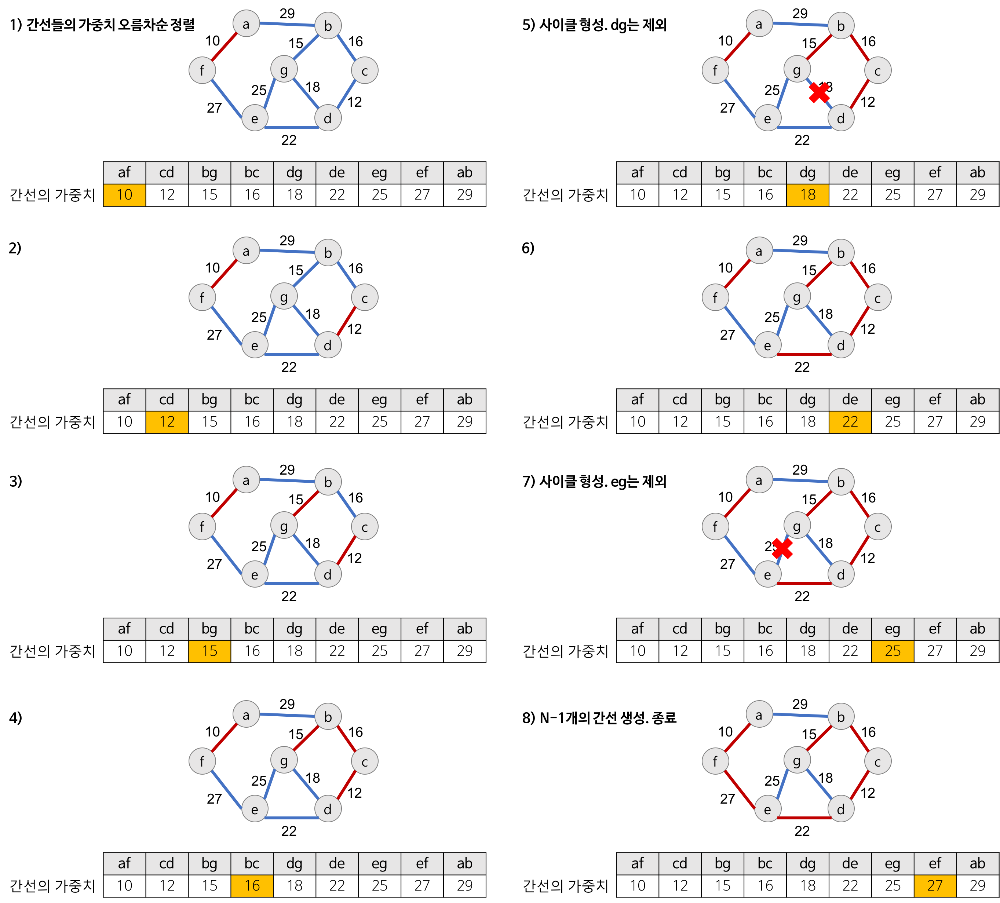
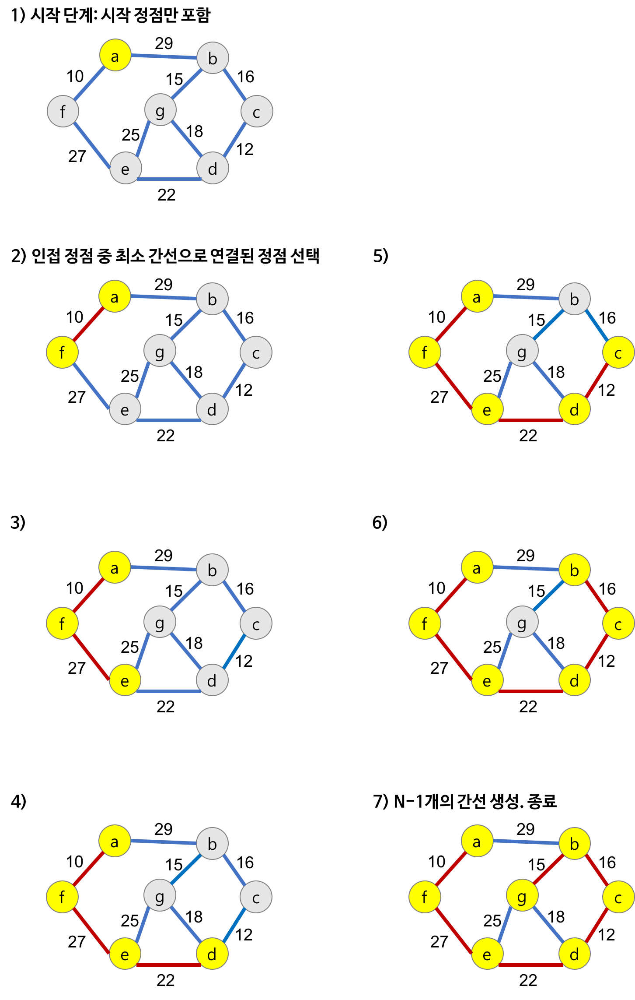

## 10주차 스터디

### 탐욕법 (Greedy method)
여러 개의 조각으로 쪼개고, 각 단계마다 답의 한 부분을 만들어간다는 점에서 "완점 탐색"이나 "동적 계획법"과 비슷하다. 두 방법은 모든 선택지를 고려해보고 그중 전체 답이 가장 좋은 것을 선택하는 반면, 탐욕법은 각 단계마다 지금 당장 가장 좋은 방법만을 선택한다.

"이렇게 간단하게 답이 나온단 말인가?"

하지만 탐욕적 알고리즘은 많은 경우 최적해를 찾지 못한다. 탐욕법이 적용되는 경우는 크게 두 가지가 있다.
1. 탐욕법을 사용해도 항상 최적해인 경우
2. 최적해는 찾기 힘들고, 적당히 괜찮은 답을 찾는 경우

프로그래밍 대회에서 근사해를 찾는 문제는 대개 출제되지 않을 뿐더러, 가끔 주어졌다 해도 메타휴리스틱 알고리즘이 더 좋은 답을 주는 경우가 많으므로 2번 경우에 쓸 일이 거의 없다.

탐욕법이 유용하게 사용되는 문제 중 유명한 예로 활동 선택 문제(Activity selection problem)이 있다.

가장 먼저 끝나는 활동을 선택하는 것이다. 위 그림의 경우 [a1, a3, a6, a8] 이 답이 될 수 있다.
> 당연히 동적 계획법을 이용해서 해결할 수도 있다.

### 최소 신장 트리 (Minimum Spanning Tree)
스패닝 트리는 그래프의 정점 전부와 간선 부분 집합들로 구성된 그래프이다.

#### 크루스칼 알고리즘 (Kruskal Algorithm)
모든 간선을 오름차수능로 정렬한 뒤, 스패닝 트리가 될 때까지 간선을 트리에 하나씩 추가한다. 싸이클을 만들지 않으면서.

#### 프림 알고리즘 (Prim Algorithm)
한 시작점을 기준으로 인접한 간선을 하나씩 추가하며 스패닝 트리가 될 때까지 키워 간다.

#### 문제
- [구명보트](https://programmers.co.kr/learn/courses/30/lessons/42885)
- [섬 연결하기](https://programmers.co.kr/learn/courses/30/lessons/42861)
