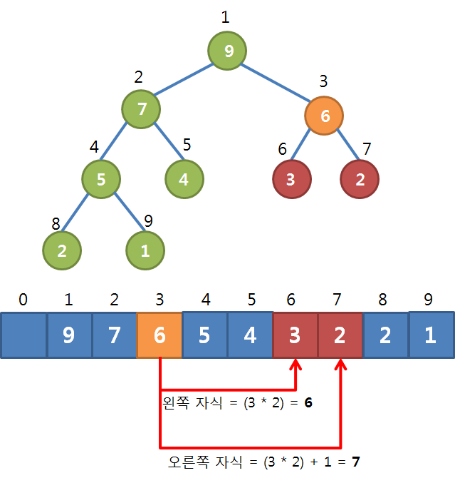
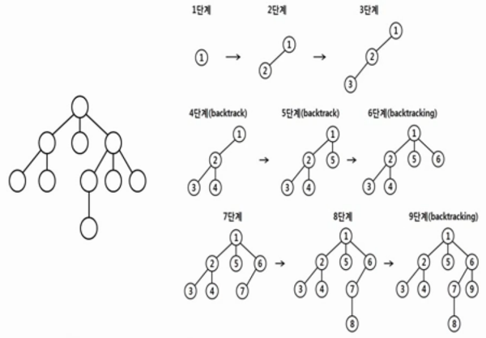
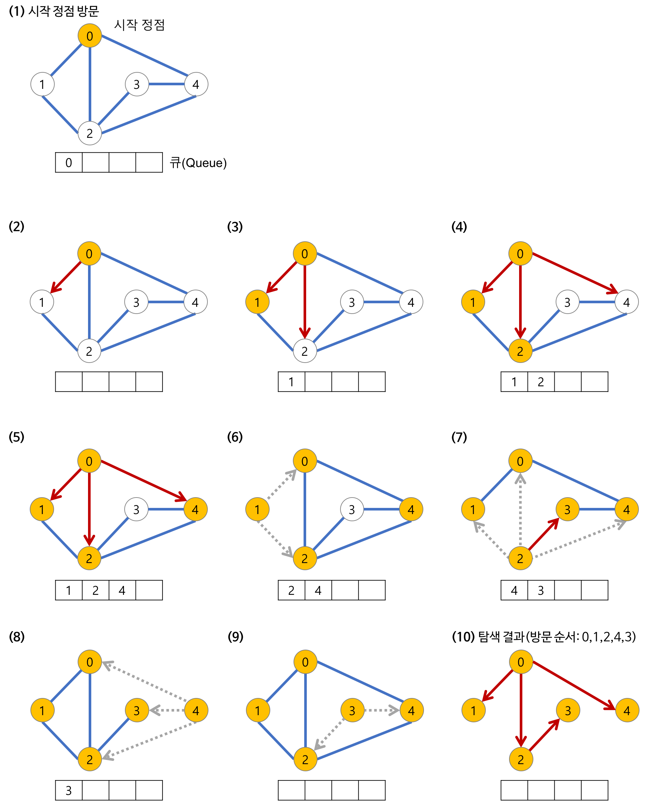

## 3주차 스터디

### 힙(Heap)
힙에는 최대힙과 최소힙이 있는데, 일단 최대힙은 부모 노드의 키 값이 자식 노드의 키 값보다 항상 큰 '완전' 이진 트리이다. 
> 완전 트리란? 노드가 순선대로 들어있는 트리. 왼쪽부터 차곡차곡 들어가는 트리를 의미한다.

따라서 노드에 차례대로 번호를 붙힐 수 있다. 이 번호를 배열의 인덱스로 생각하면 배열에 힙의 노드들을 저자할 수 있다.

어떤 노드의 왼쪽이나 오른쪽 자식의 인덱스를 알고싶으면 위와 같은 식을 이용한다.

#### 힙 정렬
위와 같은 성질을 이용해서 힙 정렬을 할 수 있다. 힙에서의 제거는 루트 값이 제거되는 것이므로 하나씩 제거하면 정렬이 알아서 된다.

데이터 삽입은 O(logN), 제거도 O(logN)의 시간복잡도를 가진다. N개의 데이터를 모두 제거하면 정렬이 되기 때문에 힙 정렬의 시간복잡도는 O(NlogN)이 된다.

---
### 그래프 탐색
- DFS(깊이 우선 탐색)
- BFS(너비 우선 탐색)

DFS는 vertax의 자식들을, BFS는 vertax의 형제들을 우선 탐색한다.

#### DFS (깊이 우선 탐색)

DFS는 어떤 정점에서 우선순위에 따라 연결된 다른 정점으로 이동할 수 있을 때까지 이동하면서 진행된다. 더이상 진행할 수 없다면 이전 정점으로 백트랙(backtracking)하여 다른 정점으로 진행하고, 모든 정점을 탐색할 때까지 반복적으로 검사하는 전체 탐색 방법이다.

백트랙은 스택(stack) 구조나 재귀(recursion)를 이용한다.

#### DFS의 시간복잡도
정점의 수: V, 간선의 수: E
- 인접 리스트로 표현된 그래프: O(V+E)
- 인접 행렬로 표현된 그래프: O(V^2)

#### BFS (너비 우선 탐색)

BFS는 정점으로부터 가까운 정점을 먼저 방문하고 멀리 떨어진 정점을 나중에 방문하는 순회 방법이다. 두 노드 사이의 최단 경로 또는 임의의 경로를 찾고 싶을 때 이 방법을 이용한다.

BFS는 재귀적으로 동작하지 않으며 방문한 노드들을 차례로 저장한 후 꺼낼 수 있는 자료구조인 큐(Queue)를 사용한다.

#### BFS의 시간복잡도
정점의 수: V, 간선의 수: E
- 인접 리스트로 표현된 그래프: O(V+E)
- 인접 행렬로 표현된 그래프: O(V^2)

----

### 같이 풀어볼 문제

프로그래머스 "타겟 넘버"

https://programmers.co.kr/learn/courses/30/lessons/43165
